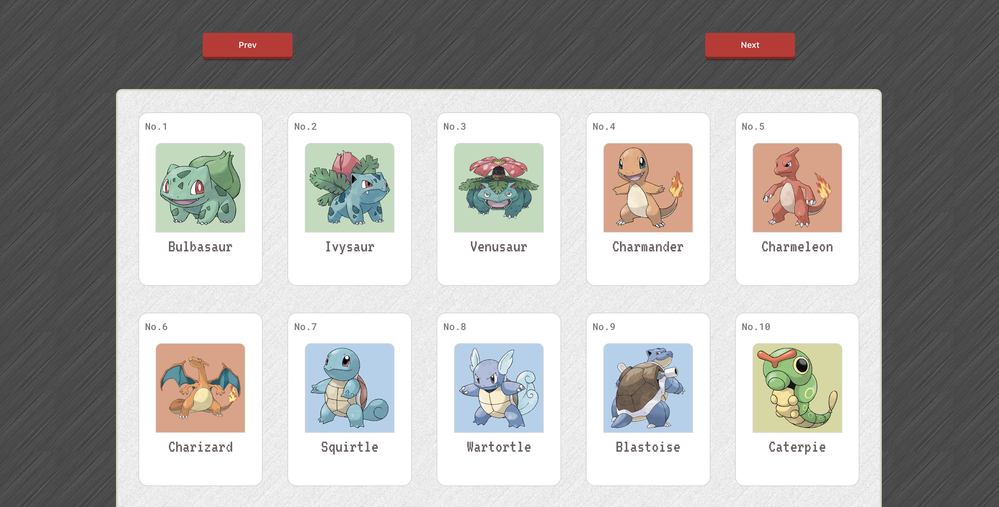
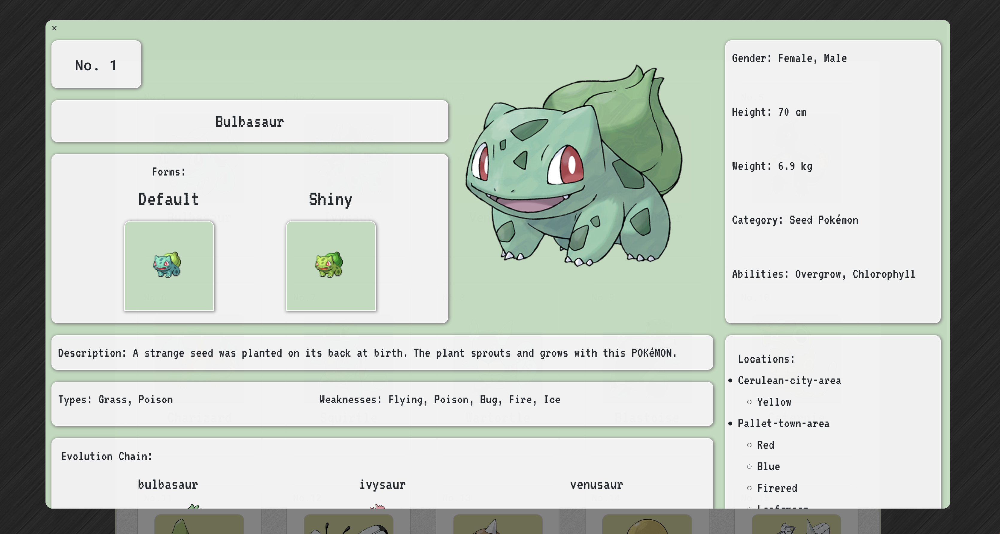
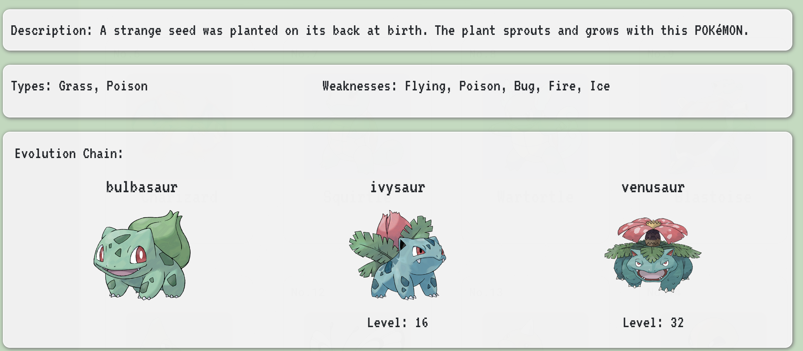
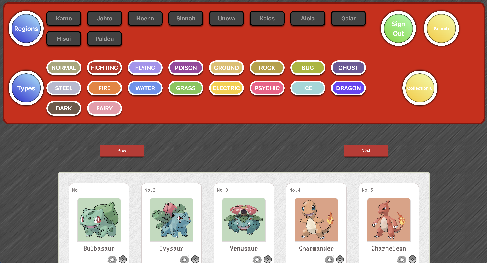
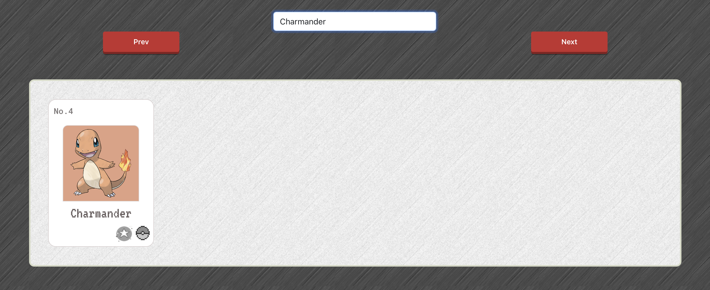

# Pokepedia
Easily search through over 1000 Pokemon to add them to your personal collection. Research and collect to your hearts content over the generations. 

## Sneak Peek

While "logged out", collection options are inactive. Researching is still available.

 
 
Navigate through multiple pages with the "Prev" and "Next" buttons.

 
 
A look at the Pokemon details page with Bulbasaur featured.

 
 
A closer look at the evolution chain of Bulbasaur.

 
 
If you dont already have an account, registering a new account is also an option.

 
 
When "logged in", your collection options are active. Add to your collection easily by using the filtering buttons in the navigation bar up top.

 
 
Filtering is expanded to the search bar. Search by name, number, type or region to narrow your search.

 
 

## Dependencies
- React
- Node
- Bootstrap
- Firebase
- Axios
- Morgan
- Nodemon
- Postgres
- Body-parser

## Testing 
- Jest
- Cypress

## Getting Started
### Frontend 
  1. Navigate to the backend file using the `cd frontend` command.
  2. Install dependencies using the `npm install` command.
  3. Start the web server using the `npm run start` command. The app will be served at <http://localhost:3000/>.
  4. Navigate to <http://localhost:3000/> in your browser.

### Backend
  1. Navigate to the backend file using the `cd backend` command.
  2. Install dependencies using the `npm install` command. 
  3. Reset your database with `npm run db:reset`.
  4. Run your backend with `npm run dev`.
